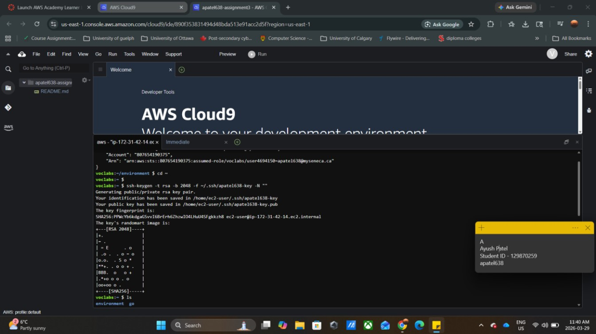
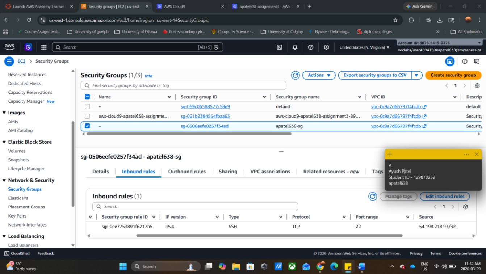
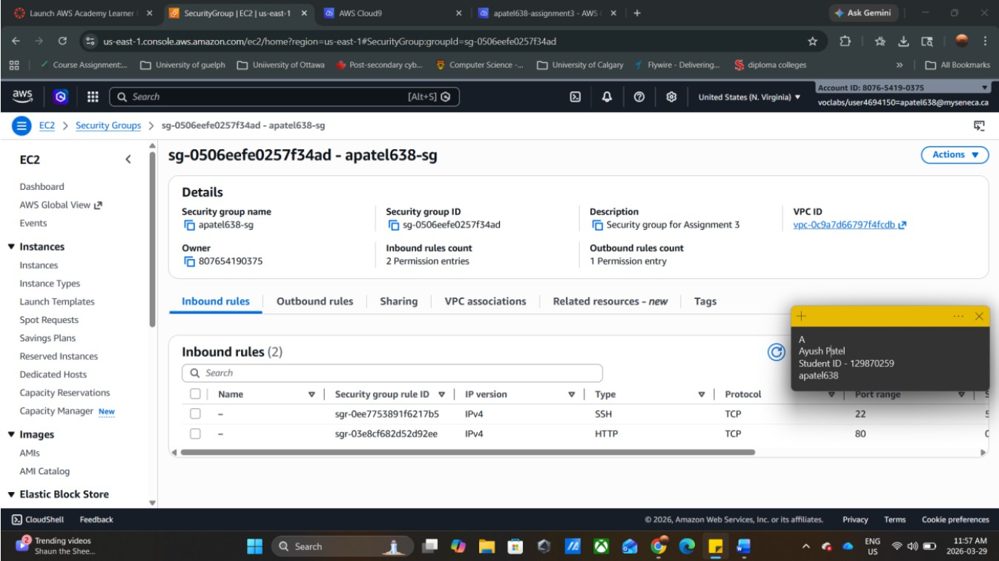
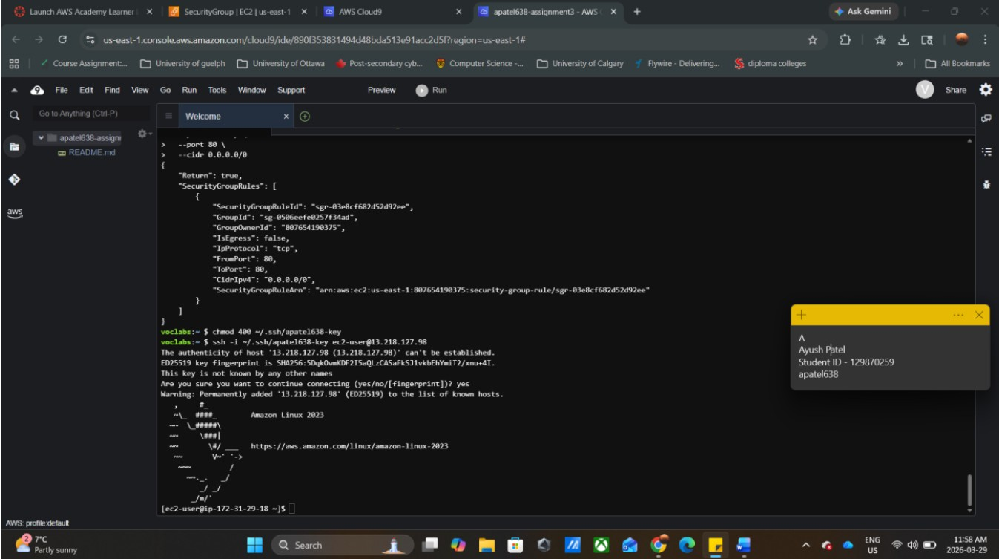
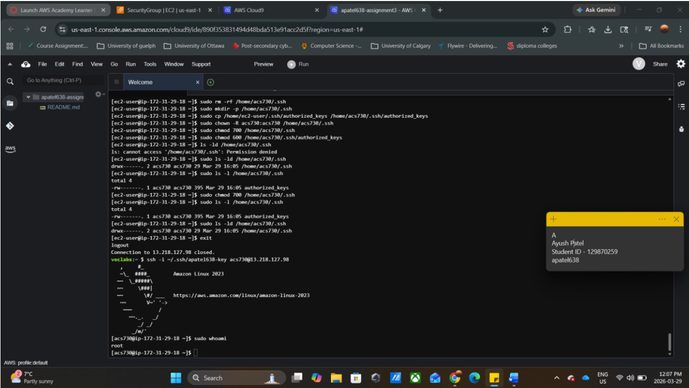
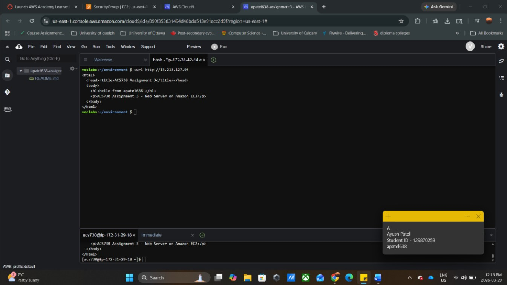
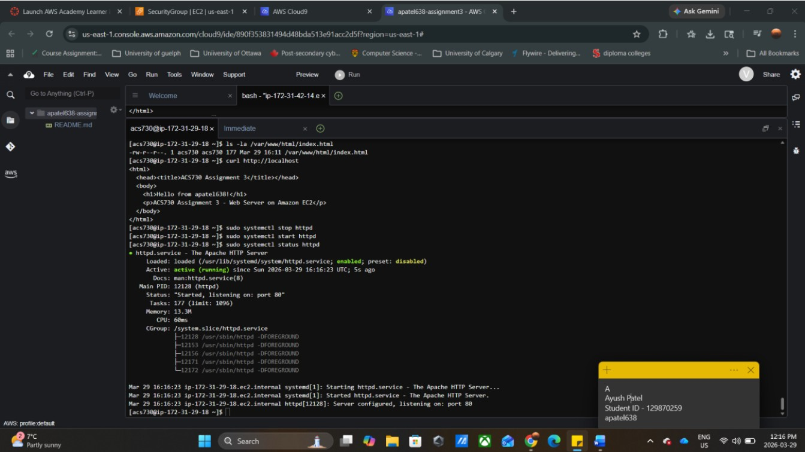
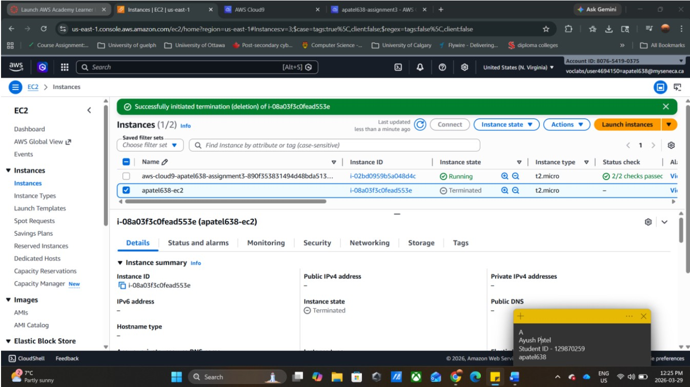

# EC2 Web Server Deployment — AWS CLI & Apache

A hands-on AWS project demonstrating the complete lifecycle of deploying and configuring an Apache web server on Amazon EC2 — from SSH key management and security group configuration to user administration and automated server setup using a Bash script. Everything is done through the AWS CLI and Linux commands, with no reliance on the AWS console for configuration.

---

## Table of Contents

- [Overview](#overview)
- [Architecture](#architecture)
- [Prerequisites](#prerequisites)
- [Task 1 — Key Pair Generation & Import](#task-1--key-pair-generation--import)
- [Task 2 — EC2 Deployment](#task-2--ec2-deployment)
- [Task 3 — SSH Access Configuration](#task-3--ssh-access-configuration)
- [Task 4 — HTTP Access Configuration](#task-4--http-access-configuration)
- [Task 5 — SSH Connection](#task-5--ssh-connection)
- [Task 6 — User Creation & Permissions](#task-6--user-creation--permissions)
- [Task 7 — Login as acs730](#task-7--login-as-acs730)
- [Task 8 — Apache Web Server Installation](#task-8--apache-web-server-installation)
- [Task 9 — Resource Cleanup](#task-9--resource-cleanup)
- [Challenges & Solutions](#challenges--solutions)
- [Key Learnings](#key-learnings)

---

## Overview

This project focuses on the foundational skills of cloud infrastructure — manually provisioning and securing an EC2 instance, managing Linux users and permissions, and automating web server deployment through scripting. Rather than using the AWS console, every configuration step is performed via the AWS CLI, reflecting real-world DevOps workflows.

| Component | Detail |
|---|---|
| Cloud Provider | AWS (us-east-1) |
| Instance Type | t2.micro |
| OS | Amazon Linux 2023 |
| Web Server | Apache (httpd) |
| Access Method | SSH via custom RSA key pair |
| Environment | AWS Cloud9 |

---

## Architecture

```
Internet
    │
    ▼
Security Group (apatel638-sg)
├── Port 22  → SSH  (restricted to your IP only)
└── Port 80  → HTTP (open to 0.0.0.0/0)
    │
    ▼
EC2 Instance (apatel638-ec2) — t2.micro, Amazon Linux 2023
├── ec2-user  (default AWS user)
└── acs730    (custom user with full sudo privileges)
    │
    ▼
Apache Web Server (httpd)
└── /var/www/html/index.html  (custom HTML page, owned by acs730)
```

---

## Prerequisites

- AWS Academy account with an active Cloud9 environment
- AWS CLI pre-configured with appropriate IAM permissions
- Basic familiarity with Linux commands and SSH

---

## Task 1 — Key Pair Generation & Import

Instead of using an AWS-generated key pair, a custom RSA key pair is created locally in the Cloud9 environment and the public key is imported into AWS. This gives full control over the private key and avoids downloading it from the console.

```bash
# Generate a 2048-bit RSA key pair
ssh-keygen -t rsa -b 2048 -f ~/.ssh/apatel638-key -N ""

# Import the public key into AWS
aws ec2 import-key-pair \
  --key-name apatel638-key \
  --public-key-material fileb://~/.ssh/apatel638-key.pub

# Verify the import was successful
aws ec2 describe-key-pairs --key-names apatel638-key
```



---

## Task 2 — EC2 Deployment

Launch a t2.micro EC2 instance using Amazon Linux 2023 with the imported key pair. The instance is tagged for easy identification and verified using the CLI before proceeding.

```bash
# Launch EC2 instance
aws ec2 run-instances \
  --image-id <amazon-linux-2023-ami-id> \
  --instance-type t2.micro \
  --key-name apatel638-key \
  --security-group-ids <your-sg-id> \
  --tag-specifications 'ResourceType=instance,Tags=[{Key=Name,Value=apatel638-ec2}]'

# Verify the instance is running
aws ec2 describe-instances \
  --filters "Name=tag:Name,Values=apatel638-ec2" \
  --query "Reservations[0].Instances[0].[InstanceId,PublicIpAddress,State.Name]" \
  --output table
```

> **Note:** Replace `<amazon-linux-2023-ami-id>` with the latest AMI ID for your region. Use `aws ec2 describe-images` or the AWS console AMI catalog to find the current ID.

---

## Task 3 — SSH Access Configuration

Security group inbound rules are configured to allow SSH access only from a specific IP address — not from the open internet. This is a critical security best practice that prevents unauthorized access to the instance.

```bash
# Allow SSH only from your current public IP
aws ec2 authorize-security-group-ingress \
  --group-id <your-sg-id> \
  --protocol tcp \
  --port 22 \
  --cidr $(curl -s ifconfig.me)/32
```



---

## Task 4 — HTTP Access Configuration

A second inbound rule is added to allow HTTP traffic on port 80 from any IP address, making the web server publicly accessible once Apache is installed.

```bash
# Allow HTTP from anywhere
aws ec2 authorize-security-group-ingress \
  --group-id <your-sg-id> \
  --protocol tcp \
  --port 80 \
  --cidr 0.0.0.0/0
```

Both SSH (port 22) and HTTP (port 80) rules are active and verified in the AWS Management Console.



---

## Task 5 — SSH Connection

With the security group configured and the instance running, SSH access is established using the custom private key. The private key permissions must be set correctly or SSH will reject the connection.

```bash
# Restrict private key permissions (required by SSH)
chmod 400 ~/.ssh/apatel638-key

# Connect to the instance as ec2-user
ssh -i ~/.ssh/apatel638-key ec2-user@<public-ip>
```



---

## Task 6 — User Creation & Permissions

A new Linux user `acs730` is created with full sudo privileges. SSH access is configured for this user by copying the authorized keys from `ec2-user` and setting correct directory and file permissions. Incorrect permissions on `.ssh/` are one of the most common causes of SSH login failures.

```bash
# Create the new user
sudo useradd -m -s /bin/bash acs730

# Grant passwordless sudo access
echo 'acs730 ALL=(ALL) NOPASSWD:ALL' | sudo tee /etc/sudoers.d/acs730

# Configure SSH access for acs730
sudo mkdir -p /home/acs730/.ssh
sudo cp /home/ec2-user/.ssh/authorized_keys /home/acs730/.ssh/authorized_keys
sudo chown -R acs730:acs730 /home/acs730/.ssh
sudo chmod 700 /home/acs730/.ssh
sudo chmod 600 /home/acs730/.ssh/authorized_keys

# Verify user exists and has sudo privileges
id acs730
sudo -l -U acs730
```

---

## Task 7 — Login as acs730

SSH into the instance as the newly created `acs730` user and confirm root-level access using `sudo whoami`.

```bash
# Login as acs730 using the same key pair
ssh -i ~/.ssh/apatel638-key acs730@<public-ip>

# Confirm sudo access
sudo whoami
# Expected output: root
```



---

## Task 8 — Apache Web Server Installation

Rather than installing Apache manually step by step, a Bash script automates the entire process — installation, HTML page creation, ownership assignment, and service startup. This approach is repeatable and eliminates human error.

### install_httpd.sh

```bash
#!/bin/bash

# Install Apache web server
sudo yum install -y httpd

# Create a custom HTML landing page
sudo bash -c 'cat > /var/www/html/index.html << HTML
<html>
<head><title>ACS730 Assignment 2</title></head>
<body>
  <h1>Hello from apatel638!</h1>
  <p>ACS730 Assignment 2 - Web Server on Amazon EC2</p>
</body>
</html>
HTML'

# Assign ownership of the page to acs730
sudo chown acs730:acs730 /var/www/html/index.html

# Start Apache and enable it to run on boot
sudo systemctl start httpd
sudo systemctl enable httpd

echo "Apache installed and running"
```

### Run the script

```bash
chmod +x install_httpd.sh
./install_httpd.sh
```

### Verify the web server

```bash
# Test locally on the instance
curl http://localhost

# Test externally via public IP (run from Cloud9)
curl http://<public-ip>

# Confirm the service is active
sudo systemctl status httpd
```





---

## Task 9 — Resource Cleanup

Once testing is complete the EC2 instance is terminated immediately. Leaving instances running — even idle ones — results in ongoing charges. Termination is done via CLI to stay consistent with the CLI-first approach used throughout.

```bash
# Retrieve the instance ID by tag name
INSTANCE_ID=$(aws ec2 describe-instances \
  --filters "Name=tag:Name,Values=apatel638-ec2" \
  --query "Reservations[0].Instances[0].InstanceId" \
  --output text)

# Terminate the instance
aws ec2 terminate-instances --instance-ids $INSTANCE_ID

# Confirm termination status
aws ec2 describe-instances \
  --instance-ids $INSTANCE_ID \
  --query "Reservations[0].Instances[0].State.Name" \
  --output text
```

> **Always terminate instances immediately after testing.** EC2 instances accrue hourly charges even when completely idle.



---

## Challenges & Solutions

| Challenge | Solution |
|---|---|
| SSH login denied for `acs730` | Fixed by setting correct permissions — `chmod 700` on `.ssh/` and `chmod 600` on `authorized_keys` |
| Key pair fingerprint warning on first connection | Expected behaviour — accepted and added host to known_hosts |
| Apache not accessible externally after install | Port 80 inbound rule was missing — added via `authorize-security-group-ingress` |

---

## Key Learnings

- Generating a custom key pair is more secure than downloading an AWS-generated one — the private key never travels over a network
- SSH permission errors are almost always a file permission issue on `.ssh/` or `authorized_keys`, not a key mismatch
- Automating server setup with a Bash script is significantly more reliable than running commands manually — especially for repeatable environments
- The principle of least privilege matters — SSH locked to a single IP, HTTP open only on port 80
- Practiced the full infrastructure lifecycle: provision → configure → verify → terminate
